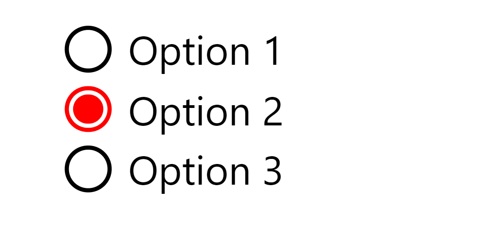

# VmComponents 

## Radio Button
&#x1F517;[Get complete code here](src/app/components/radio/)   
>**Preview** :  
   
 
**Example** :
```ts
optionsList = ['Option 1 ', 'Option 2', 'Option 3'];
optionName = 'options';
```
```ts
@for (option of optionsList; track $index) {
  <div class="vm-radio">
    <input type="radio" [id]="option" [name]="optionName" [value]="option" />
    <label [for]="option"> {{ option }} </label>
  </div>
}
```
```css
.vm-radio {
  display: flex;
  gap: 1em;
  padding-left: 0.5em;
  font-size: 1rem;
  // recommneded to change font-size in this declaration only
}
.vm-radio input[type="radio"] {
  appearance: none;
  width: 0.6em;
  height: 0.6em;
  border-radius: 50%;
  outline-offset: 0.125em;
  outline: 0.125em solid black;
  transform: translate(0.25em, 0.5em);
}
.vm-radio [type="radio"]:checked {
  background-color: red;
  outline-color: red;
}
.vm-radio label {
  font-size: 1em;
  margin-right: 1em;
  text-wrap: nowrap;
}
```

## Tooltip 
&#x1F517;[Get complete code here](src/app/directives/tooltip/)  
> Built with **ng Directive**

> **Preview** :  
   

**Example** :  
Add `tooltip` attribute to any element
```html
<button type="button" class="button primary" tooltip="It's a tooltip">Hover Over Me</button>
```

## File Input ( In progress)
&#x1F517;[Get complete code here](src/app/components/file-input/)


This project was generated with [Angular CLI](https://github.com/angular/angular-cli) version 17.1.2.

## Development server

Run `ng serve` for a dev server. Navigate to `http://localhost:4200/`. The application will automatically reload if you change any of the source files.

## Code scaffolding

Run `ng generate component component-name` to generate a new component. You can also use `ng generate directive|pipe|service|class|guard|interface|enum|module`.

## Build

Run `ng build` to build the project. The build artifacts will be stored in the `dist/` directory.

## Running unit tests

Run `ng test` to execute the unit tests via [Karma](https://karma-runner.github.io).

## Running end-to-end tests

Run `ng e2e` to execute the end-to-end tests via a platform of your choice. To use this command, you need to first add a package that implements end-to-end testing capabilities.

## Further help

To get more help on the Angular CLI use `ng help` or go check out the [Angular CLI Overview and Command Reference](https://angular.io/cli) page.
